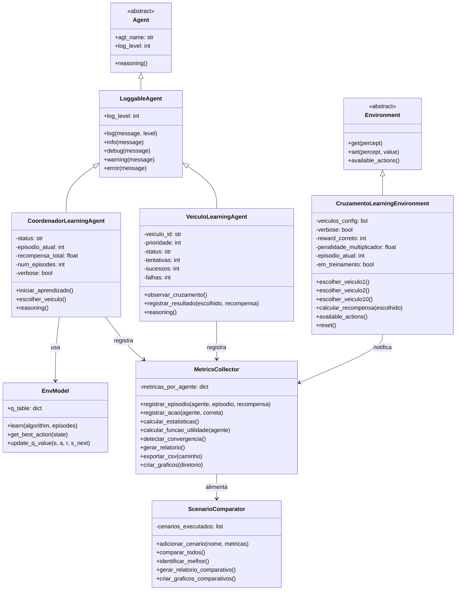
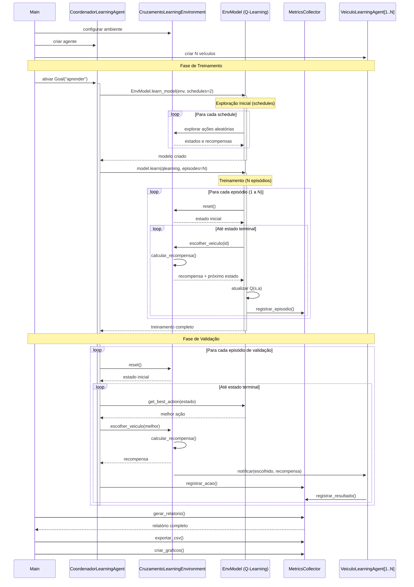
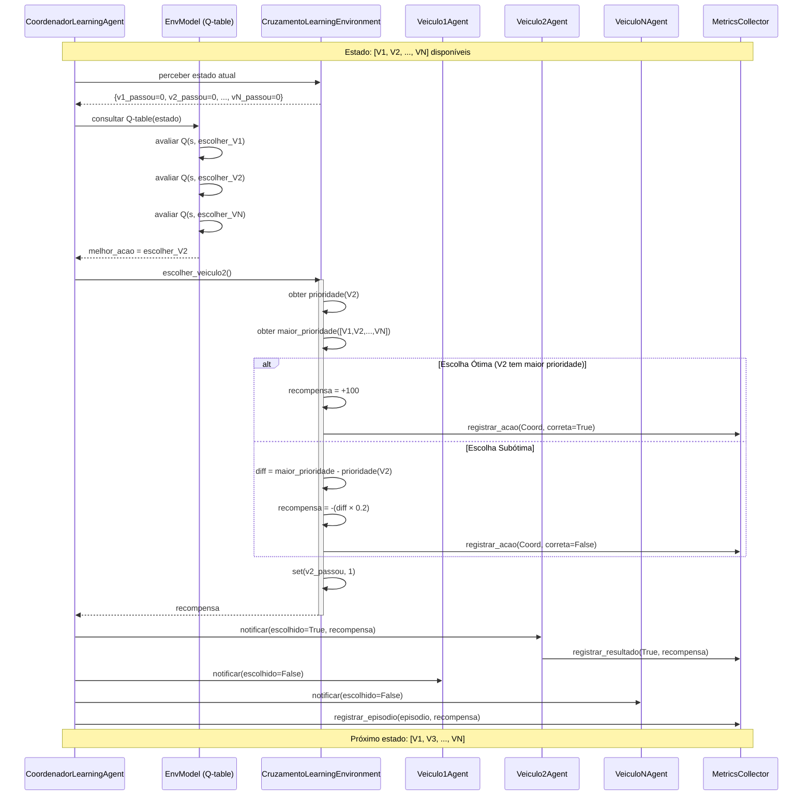
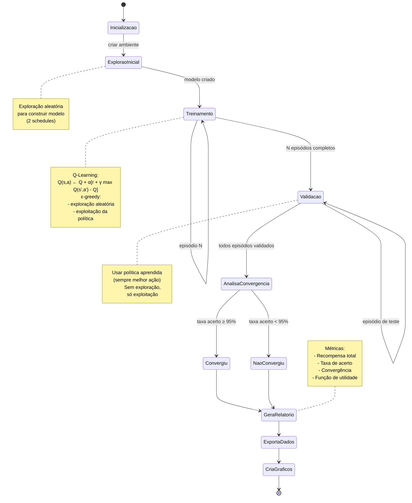
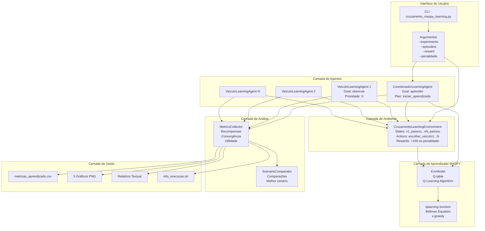
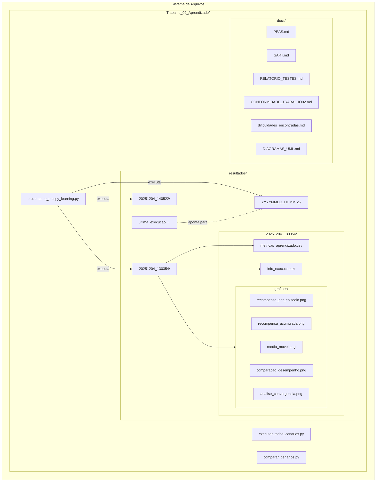
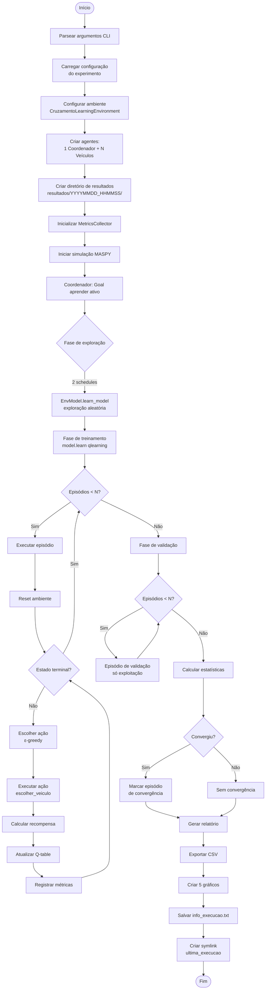
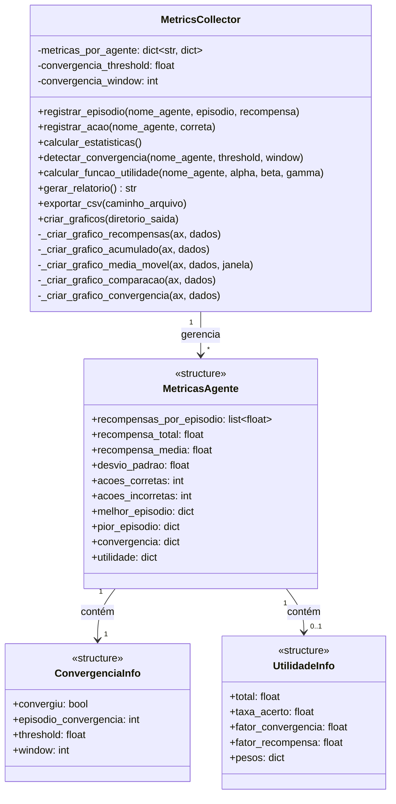

# Diagramas UML - Sistema Multi-Agentes com Q-Learning

**Disciplina:** Sistemas Multiagentes - 2025.2 - UTFPR
**Trabalho 02:** Aprendizado por Reforço
**Autores:** Guilherme T. S. Abreu, Maria Eduarda S. Freitas

---

## 1. Diagrama de Classes



---

## 2. Diagrama de Sequência - Processo de Aprendizado



---

## 3. Diagrama de Sequência - Escolha de Veículo (Decisão)



---

## 4. Diagrama de Estados - Ciclo de Aprendizado



---

## 5. Diagrama de Componentes - Arquitetura do Sistema



---

## 6. Diagrama de Deployment - Organização de Resultados



---

## 7. Diagrama de Atividades - Fluxo de Execução Principal



---

## 8. Diagrama de Classes - MetricsCollector (Detalhado)



---

## Convenções e Notas

### Padrões de Nomenclatura
- **Agentes:** Sufixo `Agent` (ex: `CoordenadorLearningAgent`)
- **Ambiente:** Sufixo `Environment`
- **Métodos públicos:** `snake_case`
- **Métodos privados:** prefixo `_`
- **Beliefs BDI:** `snake_case` (ex: `veiculo_id`, `prioridade`)
- **Goals BDI:** `Goal("string")` (ex: `Goal("aprender")`)

### Ciclo BDI
1. **Beliefs:** Estado interno do agente (prioridades, recompensas, etc.)
2. **Desires:** Goals ativos (ex: "aprender", "observar_cruzamento")
3. **Intentions:** Plans executados (ex: `iniciar_aprendizado()`)

### Q-Learning
- **Equação de Bellman:** `Q(s,a) ← Q(s,a) + α[r + γ max Q(s',a') - Q(s,a)]`
- **Parâmetros padrão:** α=0.1, γ=0.9, ε=0.1
- **Política:** ε-greedy durante treino, greedy durante validação

### Função de Utilidade PEAS
```
U = 0.5 × taxa_acerto + 0.3 × fator_convergencia + 0.2 × fator_recompensa
```

Onde:
- `taxa_acerto = corretas / (corretas + incorretas)`
- `fator_convergencia = 1 / max(1, episodio_convergencia)`
- `fator_recompensa = recompensa_media / recompensa_maxima_teorica`

---

## Referências

- **MASPY Framework:** [Documentação oficial](https://github.com/lsa-pucrs/maspy)
- **Q-Learning:** Sutton & Barto - Reinforcement Learning: An Introduction
- **PEAS:** Russell & Norvig - Artificial Intelligence: A Modern Approach
- **SART:** Metodologia específica para RL em sistemas multi-agentes

---

**Data:** 04/12/2025
**Versão:** 1.0
